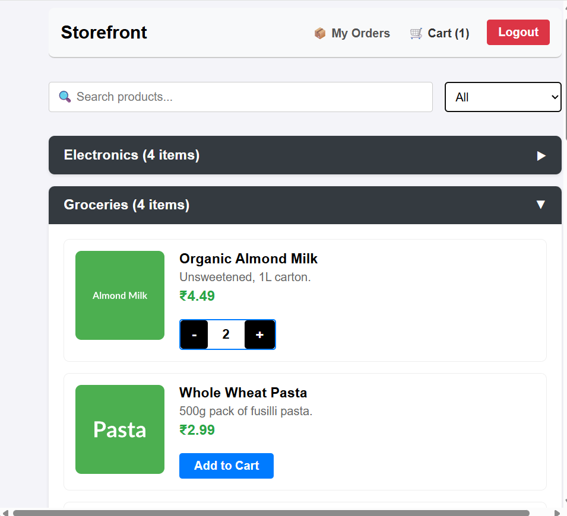

# Departmental Store - Full-Stack E-Commerce Platform

 A complete, responsive, and secure full-stack e-commerce platform built to handle product cataloging, cart management, user authentication, and administrative inventory control. 

## Live Links
- **Live Storefront (Frontend):** https://departmental-store-fullstack.vercel.app
- **Live API (Backend):** https://departmental-store-api.onrender.com

---

## Features

1. For Customers:
    - Secure Authentication: JWT-based login and registration.
    - Browse & Shop: Dynamic product catalog sorted by categories.
    - Cart Management: Add to cart, adjust quantities, and calculate totals in real-time.
    - Order History: View past orders and track current order status.

2. For Administrators:
    - Role-Based Access Control (RBAC): Exclusive dashboard for users with 'admin' privileges.
    - Inventory Management: Full CRUD (Create, Read, Update, Delete) capabilities for products.
    - Image Hosting: Seamless cloud image uploads via Cloudinary.
    - Order Fulfillment: View all customer orders across the platform.

---

## Tech Stack

- Client-Side (Frontend):
    React.js (Vite)
    React Router DOM
    Axios
    CSS3 / Styled Components
    Deployed on **Vercel**

- Server-Side (Backend):
    Node.js & Express.js
    JSON Web Tokens (JWT) & bcryptjs for Security
    Multer & Cloudinary API for Image processing
    Deployed on **Render**

- Database:
    MySQL (Hosted on **Aiven** Cloud)

---

## Screenshots

Authentication
- [Login Screen](screenshots/login.png)
- [Registration Screen](screenshots/register.png)

The Customer Experience
- [Product Storefront](screenshots/storefront.png)
- [Active Shopping Cart](screenshots/cart-full.png)
- [Customer Order History](screenshots/customer-orders.png)

The Admin Dashboard (Role-Based Access)
- [Admin Inventory Management](screenshots/admin-manage-products.png)
- [Add New Product & Cloudinary Upload](screenshots/admin-add-product.png)
- [Global Order Management](screenshots/admin-all-orders.png)

---

## Running the Project Locally

If you want to clone this repository and run it on your local machine, follow these steps:

1. Prerequisites
- Node.js installed
- A local MySQL server (or cloud DB URI)
- A Cloudinary account for image uploads

2. Clone the Repository
\`\`\`bash
git clone https://github.com/piyushhirwani235/departmental-store-fullstack.git
\`\`\`

3. Backend Setup
\`\`\`bash
cd server
npm install
\`\`\`
Create a `.env` file in the `/server` directory with the following variables:
\`\`\`env
PORT=5000
DB_HOST=your_db_host
DB_USER=your_db_user
DB_PASSWORD=your_db_password
DB_NAME=your_db_name
JWT_SECRET=your_super_secret_key
CLOUDINARY_CLOUD_NAME=your_cloud_name
CLOUDINARY_API_KEY=your_api_key
CLOUDINARY_API_SECRET=your_api_secret
\`\`\`
Run the server: `npm start` (or `npm run dev`)

4. Frontend Setup
\`\`\`bash
cd ../client
npm install
\`\`\`
Create a `.env` file in the `/client` directory:
\`\`\`env
VITE_API_URL=http://localhost:5000
\`\`\`
Run the client: `npm run dev`

---

## Future Roadmap
- [ ] Implement Stripe payment gateway integration.
- [ ] Add customer reviews and rating system for products.
- [ ] Build a password reset flow via email (Nodemailer).
- [ ] Enhance frontend UI/UX and refine responsive design components.